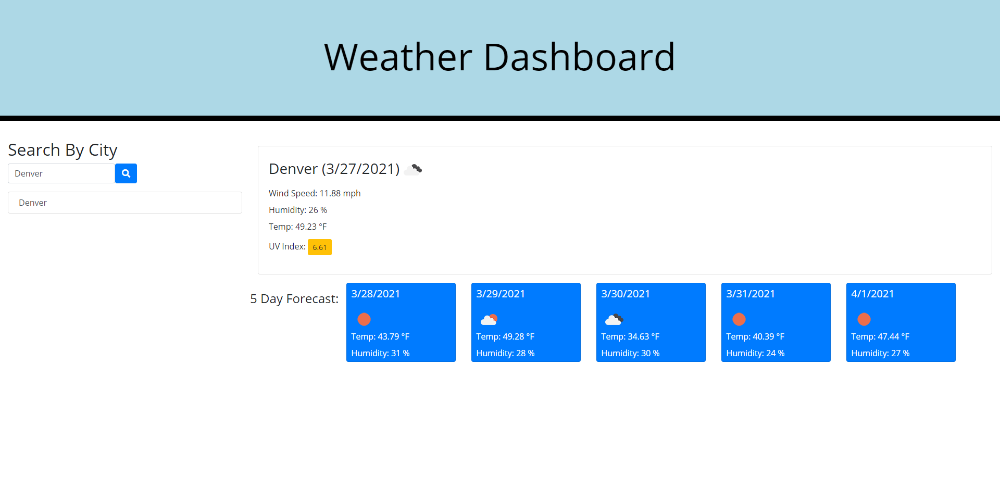

# 06-Server-Side-APIs-Weather-Dashboard

## Description of my work:

* When opening the weather dashboard, there is a form input for a city.

* When a city is entered and the search button is clicked, the user is presented with current name, date, and icon, temmperature, humidity, wind speed and the uv index. 

* The UV index is color coded for favorable, moderate and severe.

* The user is presented with a 5 day forcast.

* There is a clickable history link for each city that was searched.

## Link to Website
https://rlacer.github.io/06-Server-Side-APIs-Weather-Dashboard/

## Screenshot
